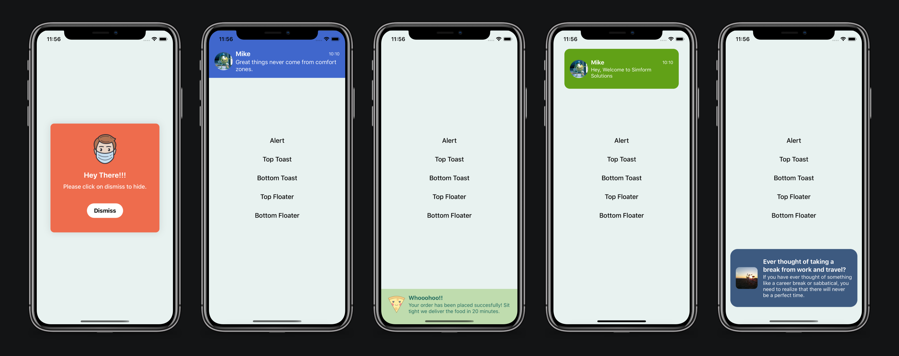

SSToastMessage
=============
[](https://travis-ci.org/scalessec/SSToastMessage)
[](http://cocoadocs.org/docsets/SSToastMessage)
[](http://cocoapods.org/pods/SSToastMessage)

SSToastMessage is written in SwiftUI. It will add toast, alert, and floating message view over the top of any view. It is intended to be simple, lightweight, and easy to use. It will be a popup with a single line of code.
Screenshots
---------


# Usage
1. Put all your body code into a ZStack, VStack, or HStack. 
2. Add a binding bool to control popup presentation state
3. Add `.present` modifier to your stack
4. If you are using NavigationBar or Custom Navigation view then add `.present` modifier to NavigationBar or Custom Navigation view.

Basic Examples
---------
```swift
struct ContentView: View {
    @State var showToast = false
    var body: some View {
        VStack {
            // your screen main stack
            Button(action: {
                self.showToast.toggle()
            }) {
                Text("Show Toast")
                    .foregroundColor(.black)
            }
        }
        .present(isPresented: self.$showToast, type: .toast, position: .top) {
           /// create your own view for toast
            self.createTopToastView()
        }
    }
    
    func createTopToastView() -> some View {
        VStack {
            Spacer(minLength: 20)
            HStack() {
                Image("mike")
                    .resizable()
                    .aspectRatio(contentMode: ContentMode.fill)
                    .frame(width: 50, height: 50)
                    .cornerRadius(25)

                VStack(alignment: .leading, spacing: 2) {
                    HStack {
                        Text("Mike")
                            .foregroundColor(.white)
                            .fontWeight(.bold)
                        Spacer()
                        Text("10:10")
                            .font(.system(size: 12))
                            .foregroundColor(Color(red: 0.9, green: 0.9, blue: 0.9))
                    }

                    Text("Hey, Don't miss the WWDC on tonight at 10 AM PST.")
                        .lineLimit(2)
                        .font(.system(size: 14))
                        .foregroundColor(.white)
                }
            }.padding(15)
        }
        .frame(width: UIScreen.main.bounds.width, height: 110)
        .background(Color(red: 0.85, green: 0.65, blue: 0.56))
    }
}
```

<br> </br>
<p align="center">
  
</p>
<br> </br>

Way easy to customize!
---------
### Required parameters 
`presented` - binding to determine if the message view should be seen on-screen or hidden     
`view` - view you want to display on your message view 

### Available customizations - optional parameters    

Element | Declaration | Description
--------|-----------|-----
type | `type: MessageType` | set type of view alert, toast and float.
position | `position: Position` |  top or bottom (for default case it just determines animation direction).
animation | `animation: Animation` | custom animation for message view sliding onto screen.
autohideDuration | `autohideDuration: Double?` |  time after which message view should disappear.
closeOnTap | `closeOnTap: Bool` | on message view tap it should disappear.
onTap | `onTap: () -> Void` | on message view tap perform any action or navigation.
closeOnTapOutside | `closeOnTapOutside: Bool` | on outside tap message view should disappear.


See the demo project for more examples.

Setup Instructions
------------------
[CocoaPods](http://cocoapods.org)
------------------
To integrate Toast-Swift into your Xcode project using CocoaPods, specify it in your `Podfile`:
```ruby
pod 'SSToastMessage', '~> 1.0.0'
```
and in your code add `import SSToastMessage`.

[Swift Package Manager](https://swift.org/package-manager/)
------------------
When using Xcode 11 or later, you can install `SSToastMessage` by going to your Project settings > `Swift Packages` and add the repository by providing the GitHub URL. Alternatively, you can go to `File` > `Swift Packages` > `Add Package Dependencies...`


## Manually

1. Add `MessageView.swift`, `DispatchWorkHolder.swift` and `View+Extension.swift` to your project.
2. Grab yourself a cold 🍺.

## Requirements
* iOS 13+
* Xcode 11+

## MIT License

Copyright (c) 2020 Simform Solutions

Permission is hereby granted, free of charge, to any person obtaining a copy
of this software and associated documentation files (the "Software"), to deal
in the Software without restriction, including without limitation the rights
to use, copy, modify, merge, publish, distribute, sublicense, and/or sell
copies of the Software, and to permit persons to whom the Software is
furnished to do so, subject to the following conditions:

The above copyright notice and this permission notice shall be included in all
copies or substantial portions of the Software.

THE SOFTWARE IS PROVIDED "AS IS", WITHOUT WARRANTY OF ANY KIND, EXPRESS OR
IMPLIED, INCLUDING BUT NOT LIMITED TO THE WARRANTIES OF MERCHANTABILITY,
FITNESS FOR A PARTICULAR PURPOSE AND NONINFRINGEMENT. IN NO EVENT SHALL THE
AUTHORS OR COPYRIGHT HOLDERS BE LIABLE FOR ANY CLAIM, DAMAGES, OR OTHER
LIABILITY, WHETHER IN AN ACTION OF CONTRACT, TORT OR OTHERWISE, ARISING FROM,
OUT OF OR IN CONNECTION WITH THE SOFTWARE OR THE USE OR OTHER DEALINGS IN THE
SOFTWARE.
